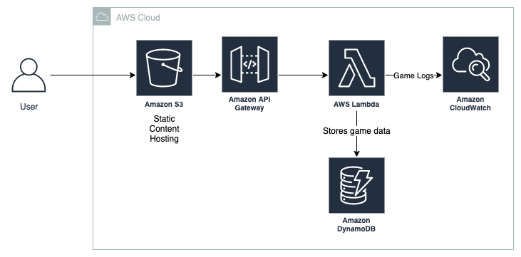

# KalahBakcend

This repository hosts the code to the backend of my Kalah game implementation. It's written in Java and meant to be deployed as an AWS Lambda Function. It communicates with its front-end counterpart, available at https://github.com/pedro-rates/kalah-frontend

## Build

Run `gradle buildZip` to generate the zip archive containing all necessary files to be deployed as a Lambda function. The file will be generated on the `build\distributions` 
directory. It's possible to upload the file to AWS Lambda using the AWS CLI or the management console.

## Unit tests

Run `gradle build` or `gradle test` to run the unit tests on the Board class.

## Architecture
